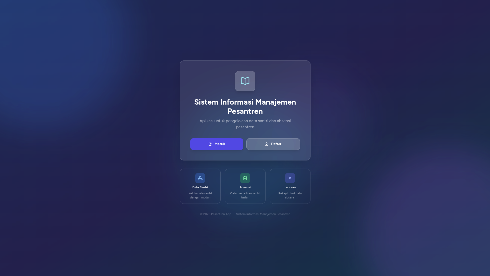
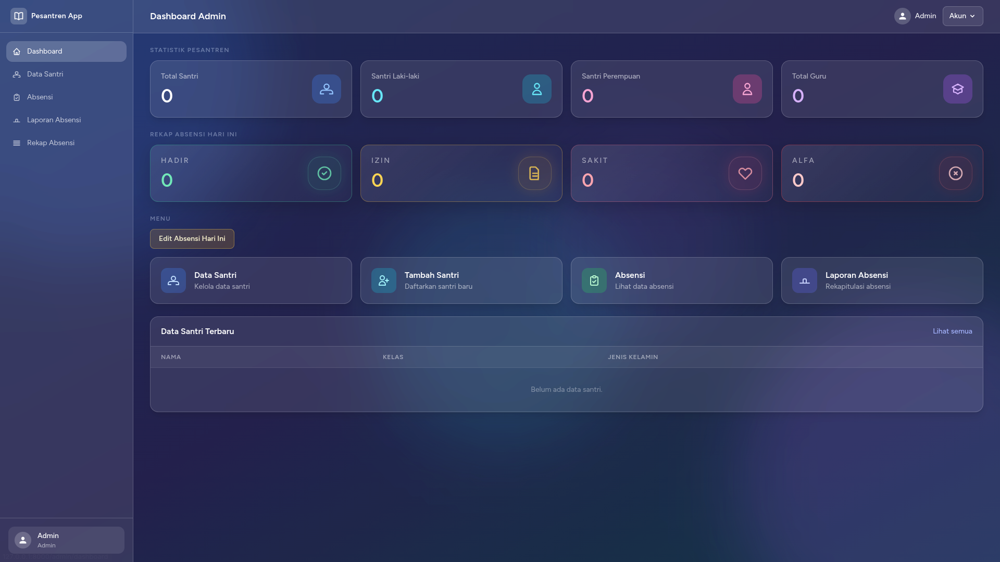
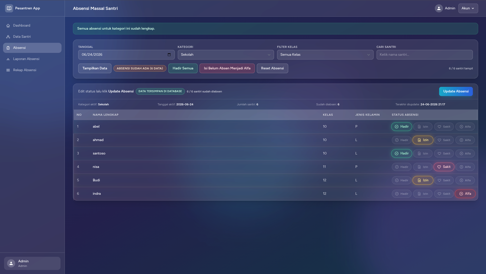
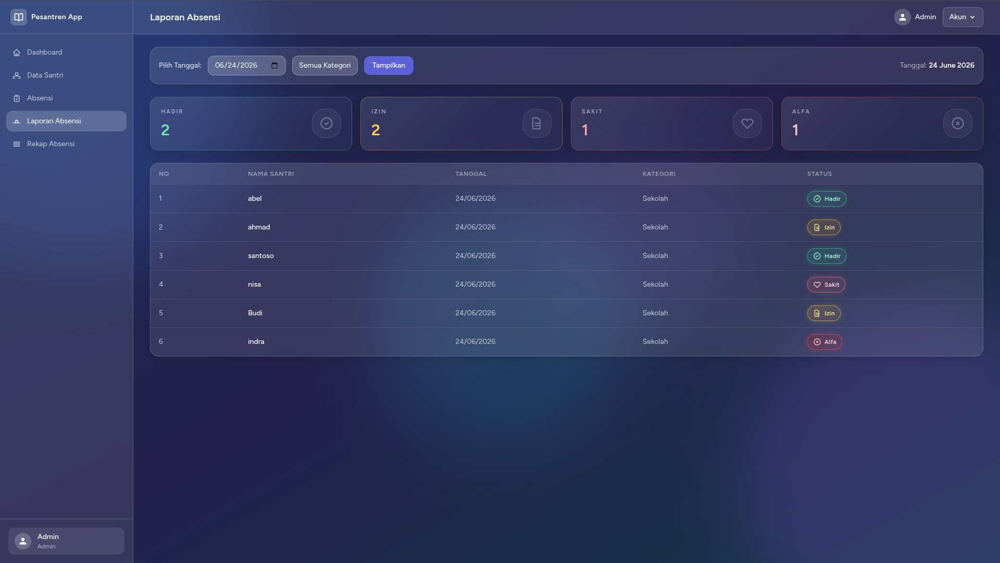

# Sistem Informasi Manajemen Pondok Sekolah - Absensi App

[](https://laravel.com/)
[](https://www.php.net/)
[](https://tailwindcss.com/)
[](https://www.mysql.com/)

Aplikasi ini adalah sistem informasi berbasis web yang dirancang untuk mempermudah pengelolaan administrasi di lingkungan pondok sekolah. `Absensi App` menyediakan solusi terintegrasi untuk manajemen data siswa, pencatatan absensi harian, serta pelaporan rekapitulasi absensi dengan sistem otorisasi berbasis peran untuk Administrator dan Guru.

## Daftar Isi

- [Fitur Utama](#fitur-utama)
- [Screenshot](#screenshot)
- [Tumpukan Teknologi](#tumpukan-teknologi)
- [Persyaratan Sistem](#persyaratan-sistem)
- [Instalasi](#instalasi)
- [Konfigurasi Lingkungan](#konfigurasi-lingkungan)
- [Migrasi Basis Data](#migrasi-basis-data)
- [Menjalankan Aplikasi](#menjalankan-aplikasi)
- [Struktur Direktori Penting](#struktur-direktori-penting)
- [Peran Pengguna](#peran-pengguna)
- [Keamanan](#keamanan)
- [Lisensi](#license)

## Fitur Utama

- **Manajemen Data Siswa**:
    - Fungsionalitas lengkap untuk membuat, membaca, memperbarui, dan menghapus (CRUD) data siswa.
    - Dukungan untuk impor data siswa secara massal melalui file Excel atau CSV, dilengkapi dengan validasi.
    - Penyediaan template impor data siswa untuk kemudahan penggunaan.
- **Manajemen Absensi**:
    - Sistem pencatatan absensi harian yang fleksibel berdasarkan tanggal dan berbagai kategori kegiatan (seperti sekolah, halaqoh, berkebun, dirosah).
    - Pilihan status absensi meliputi Hadir, Izin, Sakit, dan Alfa.
    - Fitur input absensi massal untuk efisiensi pencatatan.
    - Kemampuan untuk memperbarui dan menghapus catatan absensi yang ada.
- **Pelaporan Komprehensif**:
    - Penyajian laporan absensi harian dengan ringkasan status kehadiran.
    - Rekapitulasi absensi per semester yang dapat dikustomisasi berdasarkan tahun ajaran dan kategori, dengan opsi untuk dicetak.
- **Manajemen Pengguna & Kontrol Akses**:
    - Implementasi sistem otentikasi (login, registrasi, reset password, verifikasi email) yang aman dan teruji.
    - Otorisasi berbasis peran yang ketat, membedakan hak akses antara `Administrator` dan `Guru`.
    - Fungsionalitas manajemen profil pengguna, termasuk pembaruan informasi pribadi, perubahan kata sandi, dan penghapusan akun.
- **Dasbor Interaktif dan Adaptif**:
    - Dasbor umum yang menyajikan ringkasan data esensial bagi seluruh pengguna terautentikasi.
    - Dasbor khusus Administrator dengan tampilan statistik total siswa, jumlah guru, dan rangkuman absensi.
    - Dasbor khusus Guru yang fokus pada data absensi relevan untuk tugas mengajar.

## Screenshot

Untuk memberikan gambaran visual, berikut adalah beberapa tangkapan layar (screenshot) utama dari `Absensi App`.

| Halaman Login                                    | Halaman Dashboard (Admin)                                   |
| :----------------------------------------------- | :---------------------------------------------------------- |
|  |  |

| Manajemen Siswa                                        | Pencatatan Absensi                                      |
| :------------------------------------------------------ | :------------------------------------------------------ |
|  |  |

| Laporan Absensi                                                           |
| :------------------------------------------------------------------------ |
|  |

## Tumpukan Teknologi

Aplikasi `Absensi App` dibangun menggunakan tumpukan teknologi modern sebagai berikut:

- **Backend Framework**: Laravel v12.x (PHP)
- **Bahasa Pemrograman**: PHP ^8.3
- **Basis Data**: MySQL/MariaDB (default, direkomendasikan untuk produksi), SQLite (opsional, cocok untuk pengembangan lokal)
- **Frontend**: Blade Templating Engine (untuk rendering antarmuka), Tailwind CSS (untuk styling utility-first), Alpine.js (untuk interaktivitas JavaScript ringan)
- **Fungsionalitas Import/Export**: Menggunakan library [Maatwebsite Excel](https://docs.laravel-excel.com/)
- **Sistem Otentikasi**: Mengintegrasikan [Laravel Fortify](https://laravel.com/docs/10.x/fortify)
- **Manajemen Paket PHP**: Composer
- **Manajemen Paket Frontend**: npm / Yarn

## Persyaratan Sistem

Untuk berhasil menginstal dan menjalankan `Absensi App`, sistem Anda harus memenuhi persyaratan teknis berikut:

- **PHP**: Versi ^8.3
- **Composer**: Versi stabil terbaru
- **Node.js & npm**: Versi stabil terbaru (diperlukan untuk kompilasi aset frontend)
- **Web Server**: Nginx atau Apache
- **Basis Data**: MySQL 8.0+ / MariaDB 10.3+ atau SQLite
- **Ekstensi PHP**: Pastikan ekstensi seperti `pdo`, `mbstring`, `tokenizer`, `xml`, `ctype`, `json`, `gd` (untuk operasi gambar jika ada), dan `fileinfo` sudah terinstal dan aktif.

## Instalasi

Ikuti langkah-langkah di bawah ini untuk menyiapkan dan menjalankan `Absensi App` di lingkungan pengembangan lokal Anda:

1.  **Clone Repositori:**

    ```bash
    git clone https://github.com/AnandaAnugrahHandyanto/sekolah-app.git
    cd sekolah-app
    ```

2.  **Instal Dependensi PHP:**

    ```bash
    composer install
    ```

3.  **Instal Dependensi Frontend:**
    ```bash
    npm install
    # Kompilasi aset frontend (untuk pengembangan)
    npm run dev
    # Atau untuk produksi
    # npm run build
    ```

## Konfigurasi Lingkungan

1.  **Duplikasi File `.env`:**
    Buat salinan file `.env.example` dan ubah namanya menjadi `.env`.

    ```bash
    cp .env.example .env
    ```

2.  **Generate Application Key:**
    Hasilkan kunci enkripsi unik untuk aplikasi Anda.

    ```bash
    php artisan key:generate
    ```

3.  **Konfigurasi Basis Data:**
    Buka file `.env` dan sesuaikan parameter koneksi basis data Anda sesuai dengan pengaturan server atau lokal Anda.
    ```ini
    DB_CONNECTION=mysql
    DB_HOST=127.0.0.1
    DB_PORT=3306
    DB_DATABASE=sekolah_app_db
    DB_USERNAME=root
    DB_PASSWORD=***
    ```
    Jika Anda memilih menggunakan SQLite, atur `DB_CONNECTION=sqlite` dan pastikan ada file `database/database.sqlite` di root proyek.

## Migrasi Basis Data

Jalankan perintah migrasi untuk membuat tabel-tabel basis data yang diperlukan:

```bash
php artisan migrate
```

Untuk menambahkan data awal ke basis data (misalnya, akun admin), Anda dapat menjalankan _seeder_:

```bash
php artisan db:seed --class=AdminUserSeeder
```

(Secara default, ini akan membuat akun admin dengan email `admin@example.com` dan kata sandi `password`).

## Menjalankan Aplikasi

Setelah semua langkah instalasi dan konfigurasi selesai, Anda dapat menjalankan aplikasi menggunakan server pengembangan Laravel:

```bash
php artisan serve
```

Aplikasi kemudian akan dapat diakses melalui peramban web Anda di alamat `http://127.0.0.1:8000`.

## Struktur Direktori Penting

Berikut adalah gambaran singkat mengenai direktori-direktori kunci dalam proyek Laravel ini:

- `app/Http/Controllers`: Berisi semua _controller_ yang mengelola logika bisnis dan alur kerja aplikasi.
- `app/Models`: Mendefinisikan model-model Eloquent yang merepresentasikan tabel-tabel basis data dan relasinya.
- `app/Http/Middleware`: Tempat implementasi _middleware_ kustom, seperti `RoleMiddleware` untuk otorisasi berbasis peran.
- `database/migrations`: Berisi file-file yang mendefinisikan struktur skema basis data.
- `routes`: Mendefinisikan semua rute web dan API aplikasi.
- `resources/views`: Menyimpan semua _template_ Blade yang membentuk antarmuka pengguna.
- `public`: Direktori ini berisi aset-aset yang dapat diakses publik (CSS, JavaScript, gambar terkompilasi).
- `config`: Direktori untuk file-file konfigurasi utama aplikasi.
- `docs/images`: Direktori khusus untuk menyimpan gambar-gambar pendukung, termasuk _screenshot_ untuk dokumentasi.

## Peran Pengguna

`Absensi App` dirancang dengan sistem kontrol akses berbasis peran (Role-Based Access Control - RBAC) yang mendukung dua peran pengguna utama:

- **Administrator**: Memiliki hak akses penuh ke seluruh fungsionalitas aplikasi, termasuk manajemen lengkap data siswa (CRUD, impor), manajemen absensi, pelaporan komprehensif, dan pengelolaan pengguna sistem.
- **Guru**: Memiliki hak akses terbatas untuk mencatat absensi siswa, melihat berbagai laporan absensi, dan mengakses dasbor yang disesuaikan untuk kebutuhan pengajaran. Guru tidak memiliki hak untuk memodifikasi data master siswa atau mengelola akun pengguna lain.

## Keamanan

Aspek keamanan merupakan prioritas dalam pengembangan `Absensi App`:

- **Otentikasi Aman**: Aplikasi ini memanfaatkan [Laravel Fortify](https://laravel.com/docs/10.x/fortify) untuk mengelola semua proses otentikasi. Ini mencakup login yang aman, registrasi pengguna baru, mekanisme reset kata sandi, dan verifikasi email, memastikan standar keamanan industri yang tinggi.
- **Otorisasi Berbasis Peran**: Implementasi otorisasi dilakukan melalui _middleware_ kustom (`RoleMiddleware`). _Middleware_ ini secara ketat membatasi akses ke berbagai bagian aplikasi hanya untuk pengguna yang memiliki peran yang sesuai (misalnya, hanya `admin` yang dapat mengakses modul manajemen siswa), mencegah akses tidak sah.

## License

Copyright © 2026 Ananda Anugrah Handyanto. All Rights Reserved.

This project is protected under Indonesian Copyright Law and has been officially registered with the Directorate General of Intellectual Property (DJKI), Republic of Indonesia.

**Registration Number:** EC002026097835

See the [LICENSE.md](LICENSE.md) file for complete licensing terms.
